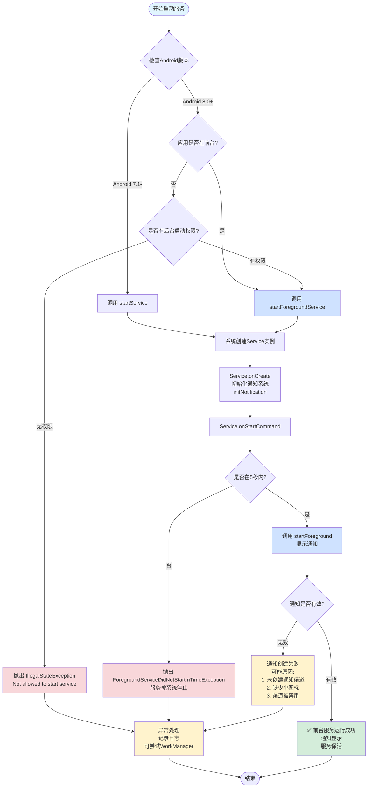
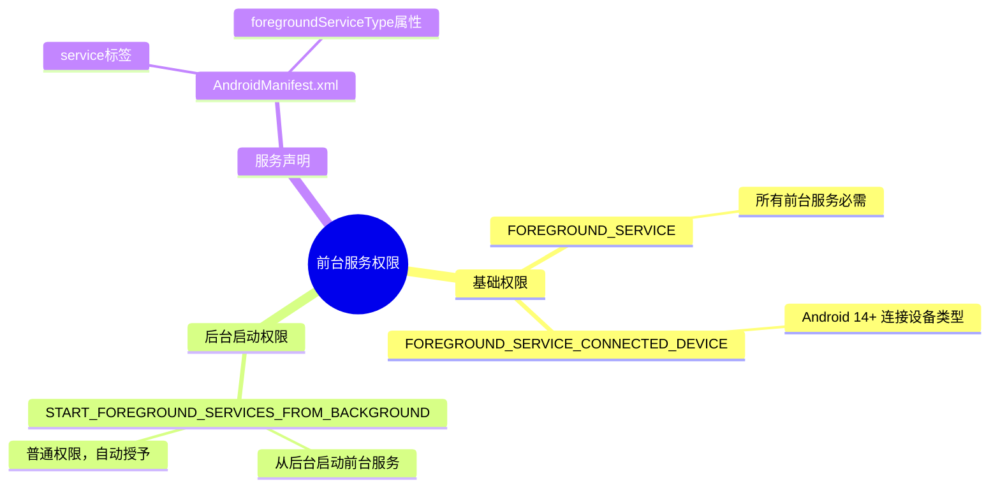
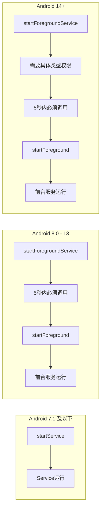
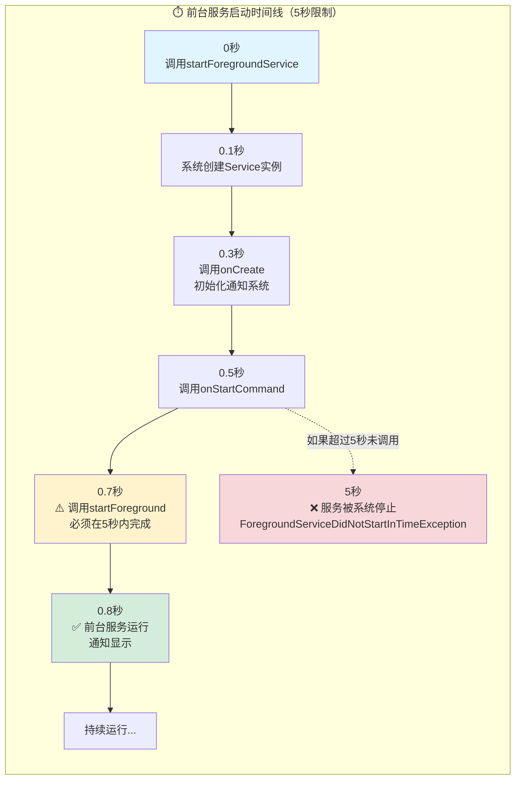
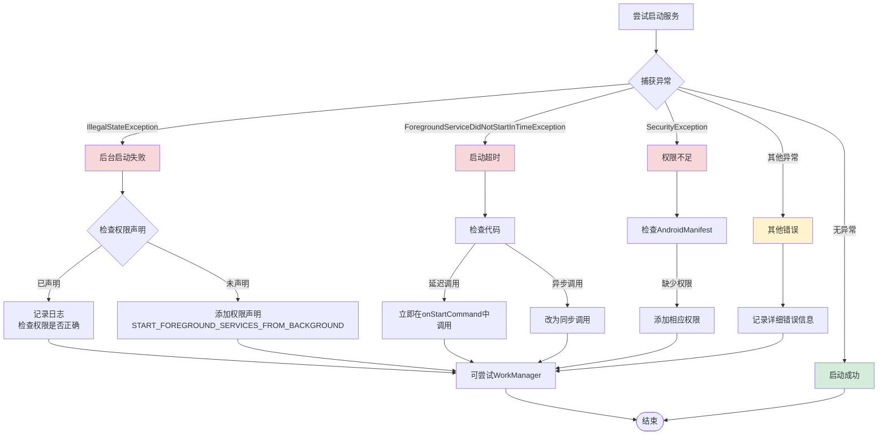

# Service 前台服务关键点流程图

## 完整流程图

## 权限要求图

## 版本差异对比图

## 时间线图

### 时间线说明

| 时间点      | 操作                            | 说明           |
| -------- | ----------------------------- | ------------ |
| **0秒**   | 调用 `startForegroundService()` | 启动前台服务       |
| **0.1秒** | 系统创建 Service 实例               | 系统创建服务对象     |
| **0.3秒** | 调用 `onCreate()`               | 初始化通知系统、监听器等 |
| **0.5秒** | 调用 `onStartCommand()`         | 服务启动命令       |
| **0.7秒** | ⚠️ **调用 `startForeground()`** | **必须在5秒内完成** |
| **0.8秒** | ✅ 前台服务运行                      | 通知显示，服务保活    |
| **5秒**   | ❌ 如果未调用 `startForeground()`   | 服务被系统强制停止    |

## 异常处理流程图

## 关键要点总结

### 1. 启动流程

- **Android 8.0+**: `startForegroundService()` → `onStartCommand()` → `startForeground()`（5秒内）
- **Android 7.1-**: `startService()` → `onStartCommand()`

### 2. 权限要求

- ✅ `FOREGROUND_SERVICE` - 基础权限
- ✅ `START_FOREGROUND_SERVICES_FROM_BACKGROUND` - 后台启动权限
- ✅ `FOREGROUND_SERVICE_CONNECTED_DEVICE` - Android 14+ 特定类型权限

### 3. 时间限制

- ⚠️ **5秒规则**: `startForegroundService()` 调用后必须在 5 秒内调用 `startForeground()`
- ⚠️ **超时后果**: 服务会被系统强制停止

### 4. 异常处理

- `IllegalStateException`: 后台启动无权限
- `ForegroundServiceDidNotStartInTimeException`: 超时未调用 `startForeground()`
- `SecurityException`: 权限不足

### 5. 通知要求

- ✅ 必须设置小图标
- ✅ Android 8.0+ 必须使用通知渠道
- ✅ 通知必须持续显示

### 6. 最佳实践

- ✅ 在 `onCreate()` 中初始化通知系统
- ✅ 在 `onStartCommand()` 中立即调用 `startForeground()`
- ✅ 区分不同类型的异常并处理
- ✅ 版本兼容处理

---

*基于《开启前台服务_startForegroundService和startForeground说明.md》和《在后台开启服务_.md》整理*
