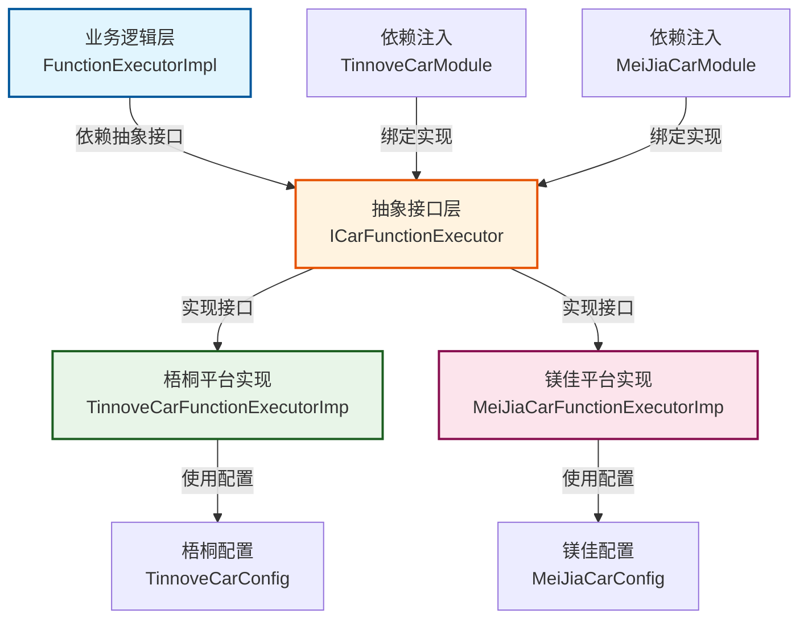
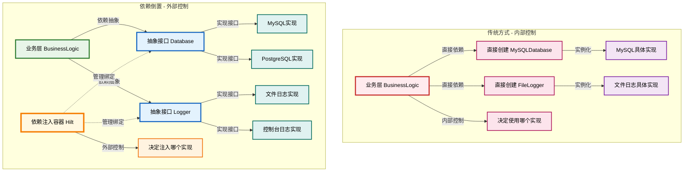
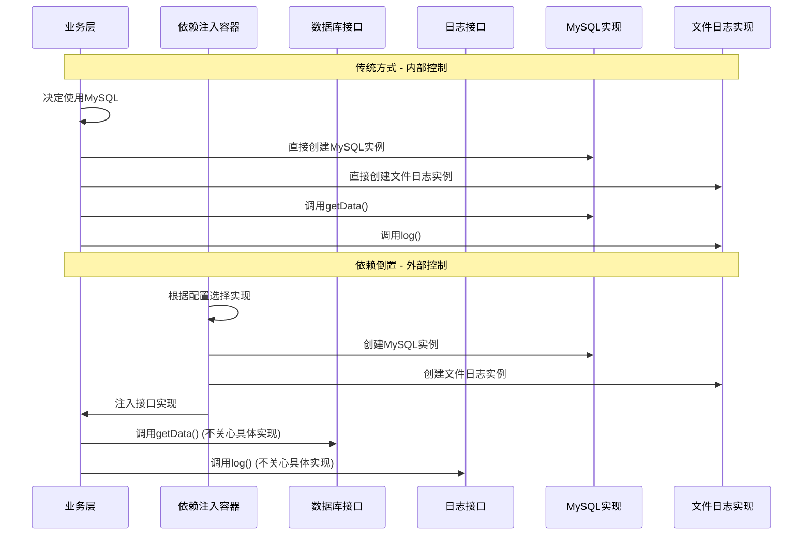
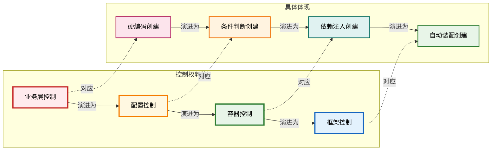

# 依赖倒置原则详解

## 1. 什么是依赖倒置原则（Dependency Inversion Principle, DIP）

依赖倒置原则是SOLID原则中的"D"，它包含两个核心概念：

### 1.1 高层模块不应该依赖低层模块，两者都应该依赖抽象

### 1.2 抽象不应该依赖细节，细节应该依赖抽象

## 2. 传统依赖关系的问题

### 2.1 违反DIP的代码示例

```kotlin
// ❌ 违反DIP的代码
class FunctionExecutorImpl {
    private val tinnoveExecutor: TinnoveCarFunctionExecutorImp = TinnoveCarFunctionExecutorImp(context)
    private val meiJiaExecutor: MeiJiaCarFunctionExecutorImp = MeiJiaCarFunctionExecutorImp(context)

    fun executeFunction(function: ButtonFunction) {
        when (function.category) {
            FunctionCategory.CAR -> {
                // 直接依赖具体实现，需要手动判断平台
                if (isTinnovePlatform()) {
                    tinnoveExecutor.adjustTailWingPosition()
                } else {
                    meiJiaExecutor.adjustTailWingPosition()
                }
            }
        }
    }

    private fun isTinnovePlatform(): Boolean {
        // 硬编码的平台判断逻辑
        return BuildConfig.CAR_PLATFORM_TYPE == "tinnove"
    }
}
```

**问题分析：**

- 高层模块（FunctionExecutorImpl）直接依赖低层模块（具体平台实现类）
- 业务层需要知道所有平台的具体实现类
- 新增平台需要修改业务层代码（添加新的if-else分支）
- 难以进行单元测试（无法Mock依赖）
- 平台判断逻辑硬编码在业务层中

## 3. 项目中的依赖倒置实现

### 3.1 接口抽象层设计

```kotlin
// ✅ 在 tuotuotie_car_interface_library 中定义抽象接口
interface ICarFunctionExecutor {
    suspend fun setAirCdFront()
    suspend fun increaseACTemperature()
    suspend fun adjustTailWingPosition()
    // ... 其他车机功能
}

interface IFunctionConfigCheck {
    fun hasFunction(configStr: String): Boolean
    fun hasTailWings(): Boolean
}
```

### 3.2 具体实现层

```kotlin
// ✅ 梧桐平台实现
@Singleton
class TinnoveCarFunctionExecutorImp @Inject constructor(
    @ApplicationContext private val context: Context
) : ICarFunctionExecutor {

    override suspend fun adjustTailWingPosition() {
        // 梧桐平台的具体实现
        if (tinnoveCarConfig.hasElectricTailSpoiler()) {
            // 执行梧桐平台的尾翼控制
        }
    }
}

// ✅ 镁佳平台实现
@Singleton
class MeiJiaCarFunctionExecutorImp @Inject constructor(
    @ApplicationContext private val context: Context
) : ICarFunctionExecutor {

    override suspend fun adjustTailWingPosition() {
        // 镁佳平台的具体实现
        if (meiJiaCarConfig.hasElectricTailSpoiler()) {
            // 执行镁佳平台的尾翼控制
        }
    }
}
```

### 3.3 依赖注入配置

```kotlin
// ✅ 通过Hilt进行依赖注入配置
@Module
@InstallIn(SingletonComponent::class)
abstract class TinnoveCarModule {

    @Binds
    @Singleton
    abstract fun bindCarFunctionExecutor(
        impl: TinnoveCarFunctionExecutorImp
    ): ICarFunctionExecutor

    @Binds
    @Singleton
    abstract fun bindFunctionConfig(
        impl: TinnoveFunctionConfigCheckImpl
    ): IFunctionConfigCheck
}
```

### 3.4 业务层使用抽象接口

```kotlin
// ✅ 业务层只依赖抽象接口
@Singleton
class FunctionExecutorImpl @Inject constructor(
    private val carFunctionExecutor: ICarFunctionExecutor,  // 依赖抽象
    private val functionConfigCheck: IFunctionConfigCheck   // 依赖抽象
) : FunctionExecutor {

    override suspend fun executeFunction(function: ButtonFunction) {
        when (function.category) {
            FunctionCategory.CAR -> {
                // 使用抽象接口，不关心具体实现
                carFunctionExecutor.adjustTailWingPosition()
            }
        }
    }
}
```

## 4. 依赖倒置的优势

### 4.1 可扩展性

```kotlin
// 新增平台只需实现接口，无需修改现有代码
class NewPlatformCarFunctionExecutorImp : ICarFunctionExecutor {
    override suspend fun adjustTailWingPosition() {
        // 新平台的具体实现
    }
}
```

### 4.2 可测试性

```kotlin
// 可以轻松创建Mock对象进行测试
class MockCarFunctionExecutor : ICarFunctionExecutor {
    override suspend fun adjustTailWingPosition() {
        // Mock实现，用于测试
    }
}

@Test
fun testFunctionExecution() {
    val mockExecutor = MockCarFunctionExecutor()
    val functionExecutor = FunctionExecutorImpl(mockExecutor, mockConfigCheck)
    // 进行单元测试
}
```

### 4.3 松耦合

```kotlin
// 业务逻辑不依赖具体实现，只依赖抽象
class BusinessLogic @Inject constructor(
    private val carExecutor: ICarFunctionExecutor  // 依赖抽象
) {
    fun processCarFunction() {
        carExecutor.adjustTailWingPosition()  // 不关心具体是哪个平台
    }
}
```

## 5. 项目中的依赖倒置层次结构



## 6. 为什么叫"倒置"？

### 6.1 传统依赖关系（正向依赖）

在传统的软件设计中，依赖关系是"正向"的：

```kotlin
// ❌ 传统依赖关系 - 高层依赖低层
class BusinessLogic {
    private val database = MySQLDatabase()  // 高层依赖低层
    private val logger = FileLogger()       // 高层依赖低层

    fun processData() {
        val data = database.getData()
        logger.log("Processing: $data")
    }
}

class MySQLDatabase {
    fun getData(): String = "MySQL data"
}

class FileLogger {
    fun log(message: String) = println("File: $message")
}
```

**依赖方向：**

```
BusinessLogic → MySQLDatabase
BusinessLogic → FileLogger
```

这是"正向"依赖，因为：

- 高层模块（BusinessLogic）直接依赖低层模块（MySQLDatabase, FileLogger）
- 低层模块的变化会影响高层模块
- 难以替换和测试

### 6.2 依赖倒置后的关系

应用依赖倒置原则后：

```kotlin
// ✅ 依赖倒置 - 都依赖抽象
interface Database {
    fun getData(): String
}

interface Logger {
    fun log(message: String)
}

class BusinessLogic(
    private val database: Database,  // 依赖抽象
    private val logger: Logger      // 依赖抽象
) {
    fun processData() {
        val data = database.getData()
        logger.log("Processing: $data")
    }
}

// 具体实现
class MySQLDatabase : Database {
    override fun getData(): String = "MySQL data"
}

class FileLogger : Logger {
    override fun log(message: String) = println("File: $message")
}
```

**依赖方向：**

```
BusinessLogic → Database (抽象)
BusinessLogic → Logger (抽象)
MySQLDatabase → Database (抽象)
FileLogger → Logger (抽象)
```

### 6.3 依赖方向的倒置

**传统方式：**

```
高层模块 → 低层模块
```

**倒置后：**

```
高层模块 → 抽象 ← 低层模块
```

## 7. 控制权倒置

### 7.1 传统方式（内部控制）

```kotlin
// ❌ 如果按传统方式，业务层会这样写：
class FunctionExecutorImpl {
    private val tinnoveExecutor = TinnoveCarFunctionExecutorImp(context)
    private val meiJiaExecutor = MeiJiaCarFunctionExecutorImp(context)

    fun executeFunction(function: ButtonFunction) {
        when (function.category) {
            FunctionCategory.CAR -> {
                // 业务层直接决定使用哪个实现
                if (isTinnovePlatform()) {
                    tinnoveExecutor.adjustTailWingPosition()
                } else {
                    meiJiaExecutor.adjustTailWingPosition()
                }
            }
        }
    }

    private fun isTinnovePlatform(): Boolean {
        return BuildConfig.CAR_PLATFORM_TYPE == "tinnove"
    }
}
```

**问题：**

- 业务层需要知道所有平台的具体实现
- 新增平台需要修改业务层代码
- 业务层控制着使用哪个实现

### 7.2 倒置后的方式

```kotlin
// ✅ 倒置后，业务层只依赖抽象：
class FunctionExecutorImpl @Inject constructor(
    private val carFunctionExecutor: ICarFunctionExecutor  // 只依赖抽象
) {
    fun executeFunction() {
        // 业务层不关心具体实现，只调用接口
        carFunctionExecutor.adjustTailWingPosition()
    }
}

// 具体实现由依赖注入决定
@Module
@InstallIn(SingletonComponent::class)
abstract class TinnoveCarModule {
    @Binds
    @Singleton
    abstract fun bindCarFunctionExecutor(
        impl: TinnoveCarFunctionExecutorImp
    ): ICarFunctionExecutor
}
```

**倒置的体现：**

- 业务层不再控制使用哪个实现
- 由依赖注入容器（Hilt）决定注入哪个实现
- 业务层只关心抽象接口的行为

## 8. 控制权倒置对比图



## 9. 控制权倒置的详细流程



## 10. 项目中的控制权倒置示例

```mermaid
graph TD
    subgraph "传统方式 - 业务层控制"
        A1[FunctionExecutorImpl] -->|硬编码判断| B1[平台类型判断]
        A1 -->|直接创建| C1[Tinnove实现]
        A1 -->|直接创建| D1[MeiJia实现]

        B1 -->|调用方法| E1{isTinnovePlatform}
        E1 -->|true| C1
        E1 -->|false| D1
    end

    subgraph "依赖倒置 - Gradle+Hilt控制"
        A2[FunctionExecutorImpl] -->|依赖抽象| F[ICarFunctionExecutor]

        G[Gradle构建脚本] -->|读取配置| H[CAR_PLATFORM_TYPE]
        H -->|动态选择| I[选择实现模块]

        I -->|编译时选择| J[TinnoveModule]
        I -->|编译时选择| K[MeiJiaModule]

        J -->|绑定实现| L[TinnoveCarExecutor]
        K -->|绑定实现| M[MeiJiaCarExecutor]

        N[Hilt容器] -.->|管理绑定| F
        L -->|实现接口| F
        M -->|实现接口| F
    end

    style A1 fill:#ffebee,stroke:#c62828,stroke-width:3px,color:#000
    style A2 fill:#e8f5e8,stroke:#2e7d32,stroke-width:3px,color:#000
    style G fill:#fff8e1,stroke:#f57c00,stroke-width:4px,color:#000
    style N fill:#fff8e1,stroke:#f57c00,stroke-width:4px,color:#000
    style F fill:#e3f2fd,stroke:#1565c0,stroke-width:3px,color:#000
    style H fill:#f3e5f5,stroke:#7b1fa2,stroke-width:3px,color:#000
    style B1 fill:#fce4ec,stroke:#ad1457,stroke-width:2px,color:#000
    style C1 fill:#fce4ec,stroke:#ad1457,stroke-width:2px,color:#000
    style D1 fill:#fce4ec,stroke:#ad1457,stroke-width:2px,color:#000
    style E1 fill:#f3e5f5,stroke:#7b1fa2,stroke-width:2px,color:#000
    style I fill:#fff3e0,stroke:#ef6c00,stroke-width:2px,color:#000
    style J fill:#e0f2f1,stroke:#00695c,stroke-width:2px,color:#000
    style K fill:#e0f2f1,stroke:#00695c,stroke-width:2px,color:#000
    style L fill:#e0f2f1,stroke:#00695c,stroke-width:2px,color:#000
    style M fill:#e0f2f1,stroke:#00695c,stroke-width:2px,color:#000
```



## 11. 控制权倒置的层次结构

控制权倒置是一个渐进的过程，从最初的业务层内部控制逐步演进到框架层面的自动控制。这个过程体现了软件架构的成熟度提升。

### 11.1 控制权转移的四个层次

#### 第一层：业务层控制（Business Layer Control）

**特点：** 业务代码直接控制对象的创建和使用
**问题：** 硬编码、紧耦合、难以测试和扩展

```kotlin
// ❌ 业务层控制示例
class FunctionExecutorImpl {
    private val tinnoveExecutor = TinnoveCarFunctionExecutorImp(context)
    private val meiJiaExecutor = MeiJiaCarFunctionExecutorImp(context)

    fun executeFunction() {
        // 业务层直接决定使用哪个实现
        if (isTinnovePlatform()) {
            tinnoveExecutor.adjustTailWingPosition()
        } else {
            meiJiaExecutor.adjustTailWingPosition()
        }
    }
}
```

#### 第二层：配置控制（Configuration Control）

**特点：** 通过配置文件或环境变量控制行为
**优势：** 减少硬编码，提高灵活性

```kotlin
// ✅ 配置控制示例
class FunctionExecutorImpl {
    private val executor: ICarFunctionExecutor

    init {
        val platformType = System.getProperty("CAR_PLATFORM_TYPE", "tinnove")
        executor = when (platformType) {
            "tinnove" -> TinnoveCarFunctionExecutorImp(context)
            "meijia" -> MeiJiaCarFunctionExecutorImp(context)
            else -> throw IllegalArgumentException("Unsupported platform")
        }
    }
}
```

#### 第三层：容器控制（Container Control）

**特点：** 依赖注入容器管理对象的生命周期和依赖关系
**优势：** 松耦合、易测试、生命周期管理

```kotlin
// ✅ 容器控制示例
@Singleton
class FunctionExecutorImpl @Inject constructor(
    private val carExecutor: ICarFunctionExecutor  // 容器注入
) {
    fun executeFunction() {
        carExecutor.adjustTailWingPosition()  // 不关心具体实现
    }
}

@Module
@InstallIn(SingletonComponent::class)
abstract class CarModule {
    @Binds
    abstract fun bindCarExecutor(impl: TinnoveCarFunctionExecutorImp): ICarFunctionExecutor
}
```

#### 第四层：框架控制（Framework Control）

**特点：** 框架自动处理所有依赖关系，开发者只需声明接口
**优势：** 零配置、自动装配、高度抽象

```kotlin
// ✅ 框架控制示例（Spring Boot风格）
@Component
class FunctionExecutorImpl(
    private val carExecutor: ICarFunctionExecutor  // 框架自动装配
) {
    fun executeFunction() {
        carExecutor.adjustTailWingPosition()
    }
}

// 框架根据条件自动选择实现
@ConditionalOnProperty(name = "car.platform", havingValue = "tinnove")
@Component
class TinnoveCarFunctionExecutorImp : ICarFunctionExecutor { ... }
```

### 11.2 具体体现的演进过程

#### 硬编码创建 → 条件判断创建

```kotlin
// 硬编码创建
private val executor = TinnoveCarFunctionExecutorImp(context)

// 条件判断创建
private val executor = if (isTinnovePlatform()) {
    TinnoveCarFunctionExecutorImp(context)
} else {
    MeiJiaCarFunctionExecutorImp(context)
}
```

#### 条件判断创建 → 依赖注入创建

```kotlin
// 条件判断创建
init {
    executor = when (platformType) {
        "tinnove" -> TinnoveCarFunctionExecutorImp(context)
        "meijia" -> MeiJiaCarFunctionExecutorImp(context)
        else -> throw IllegalArgumentException("Unsupported platform")
    }
}

// 依赖注入创建
@Inject constructor(
    private val executor: ICarFunctionExecutor  // 容器负责创建
)
```

#### 依赖注入创建 → 自动装配创建

```kotlin
// 依赖注入创建（需要手动配置）
@Module
abstract class CarModule {
    @Binds
    abstract fun bindCarExecutor(impl: TinnoveCarFunctionExecutorImp): ICarFunctionExecutor
}

// 自动装配创建（框架自动处理）
@Component
class FunctionExecutorImpl(
    private val executor: ICarFunctionExecutor  // 框架自动装配
)
```

### 11.3 项目中的实际应用

在我们的项目中，控制权倒置体现在以下层次：

#### 编译时控制（Gradle层面）

```kotlin
// build.gradle
val carPlatformType = project.findProperty("CAR_PLATFORM_TYPE") as String? ?: "tinnove"

when (carPlatformType) {
    "tinnove" -> {
        implementation(project(":TuoTuoTieTinnoveCarImplLibrary"))
    }
    else -> {
        implementation(project(":TuoTuoTieMeijiaCarImpLibrary"))
    }
}
```

#### 运行时控制（Hilt容器控制）

```kotlin
// 业务层只依赖抽象
@Singleton
class FunctionExecutorImpl @Inject constructor(
    private val carExecutor: ICarFunctionExecutor  // Hilt容器注入
) {
    fun executeFunction() {
        carExecutor.adjustTailWingPosition()  // 不关心具体实现
    }
}

// Hilt模块手动配置绑定
@Module
@InstallIn(SingletonComponent::class)
abstract class TinnoveCarModule {
    @Binds
    @Singleton
    abstract fun bindCarFunctionExecutor(impl: TinnoveCarFunctionExecutorImp): ICarFunctionExecutor
}
```

**项目控制权分析：**

- **控制层次**：第三层 - 容器控制（Container Control）
- **控制方式**：Hilt依赖注入容器管理
- **配置方式**：手动配置@Binds和@Provides注解
- **选择机制**：编译时通过Gradle选择模块，运行时通过Hilt容器管理依赖

### 11.3.1 为什么是容器控制而不是框架控制？

#### 容器控制的特征（项目现状）：

1. **手动配置**：需要开发者手动编写@Binds和@Provides注解
2. **显式绑定**：接口与实现的关系需要明确声明
3. **模块化配置**：按功能模块组织依赖注入配置
4. **编译时检查**：依赖关系在编译时确定

```kotlin
// 需要手动配置绑定
@Module
@InstallIn(SingletonComponent::class)
abstract class TinnoveCarModule {
    @Binds
    @Singleton
    abstract fun bindCarFunctionExecutor(impl: TinnoveCarFunctionExecutorImp): ICarFunctionExecutor
}
```

#### 框架控制的特征（真正的框架控制）：

1. **自动装配**：框架根据类型和条件自动选择实现
2. **条件注解**：使用条件注解自动选择
3. **零配置**：无需手动编写绑定代码
4. **运行时发现**：框架在运行时自动发现和装配组件

```kotlin
// 真正的框架控制示例（Spring Boot风格）
@ConditionalOnProperty(name = "car.platform", havingValue = "tinnove")
@Component
class TinnoveCarFunctionExecutorImp : ICarFunctionExecutor { ... }

@ConditionalOnProperty(name = "car.platform", havingValue = "meijia")
@Component  
class MeiJiaCarFunctionExecutorImp : ICarFunctionExecutor { ... }

// 业务层无需任何配置，框架自动装配
@Service
class FunctionExecutorImpl(
    private val carExecutor: ICarFunctionExecutor  // 框架自动选择实现
) {
    fun executeFunction() {
        carExecutor.adjustTailWingPosition()
    }
}
```

#### 项目选择容器控制的原因：

1. **Android生态**：Hilt是Android官方推荐的DI框架
2. **编译时安全**：编译时检查依赖关系，减少运行时错误
3. **性能优化**：编译时生成代码，运行时性能更好
4. **团队熟悉度**：团队对Hilt的使用更加熟悉
5. **渐进式升级**：可以从容器控制逐步升级到框架控制

### 11.3.2 Android中的依赖注入框架分类

#### Android中的容器控制框架

**重要说明**：Hilt和Koin都属于**容器控制**，不是框架控制！

##### 1. Hilt（项目当前使用）

**特点**：编译时生成、显式绑定、Android官方推荐

```kotlin
// Hilt模块定义（容器控制）
@Module
@InstallIn(SingletonComponent::class)
abstract class TinnoveCarModule {
    @Binds
    @Singleton
    abstract fun bindCarFunctionExecutor(impl: TinnoveCarFunctionExecutorImp): ICarFunctionExecutor
}

// 使用方式
@Singleton
class FunctionExecutorImpl @Inject constructor(
    private val carExecutor: ICarFunctionExecutor  // 容器注入
) {
    fun executeFunction() {
        carExecutor.adjustTailWingPosition()
    }
}
```

##### 2. Koin（容器控制）

**特点**：轻量级、函数式DSL、运行时解析

```kotlin
// Koin模块定义（容器控制）
val carModule = module {
    single<ICarFunctionExecutor> {
        when (BuildConfig.CAR_PLATFORM_TYPE) {
            "tinnove" -> TinnoveCarFunctionExecutorImp()
            "meijia" -> MeiJiaCarFunctionExecutorImp()
            else -> throw IllegalArgumentException("Unsupported platform")
        }
    }
}

// 使用方式
class FunctionExecutorImpl {
    private val carExecutor: ICarFunctionExecutor by inject()  // 容器注入

    fun executeFunction() {
        carExecutor.adjustTailWingPosition()
    }
}
```

##### 3. Dagger（容器控制）

**特点**：编译时生成、高性能、复杂配置

```kotlin
// Dagger模块定义（容器控制）
@Module
abstract class CarModule {
    @Binds
    abstract fun bindCarExecutor(impl: TinnoveCarFunctionExecutorImp): ICarFunctionExecutor
}

// 使用方式
class FunctionExecutorImpl @Inject constructor(
    private val carExecutor: ICarFunctionExecutor  // 容器注入
) {
    fun executeFunction() {
        carExecutor.adjustTailWingPosition()
    }
}
```

#### Android中的框架控制（真正的框架控制）

##### 1. 自定义框架控制

**特点**：基于反射、运行时发现、条件装配

```kotlin
// 自定义注解
@Target(AnnotationTarget.CLASS)
@Retention(AnnotationRetention.RUNTIME)
annotation class AutoInject

@Target(AnnotationTarget.FIELD)
@Retention(AnnotationRetention.RUNTIME)
annotation class ConditionalOnProperty(val name: String, val value: String)

// 框架控制实现
class FrameworkController {
    fun injectDependencies(target: Any) {
        val fields = target.javaClass.declaredFields

        fields.forEach { field ->
            if (field.isAnnotationPresent(ConditionalOnProperty::class.java)) {
                val annotation = field.getAnnotation(ConditionalOnProperty::class.java)
                val propertyValue = System.getProperty(annotation.name)

                if (propertyValue == annotation.value) {
                    field.isAccessible = true
                    field.set(target, createInstance(field.type))
                }
            }
        }
    }

    private fun createInstance(type: Class<*>): Any {
        return type.getDeclaredConstructor().newInstance()
    }
}

// 使用示例
@AutoInject
class FunctionExecutorImpl {
    @ConditionalOnProperty("car.platform", "tinnove")
    private lateinit var tinnoveExecutor: TinnoveCarFunctionExecutorImp

    @ConditionalOnProperty("car.platform", "meijia")
    private lateinit var meiJiaExecutor: MeiJiaCarFunctionExecutorImp
}
```

#### 4. Android中的框架控制限制

**为什么Android中框架控制不如Spring Boot成熟？**

1. **平台特性**：
   
   - Android应用生命周期复杂
   - 组件间通信需要显式管理
   - 内存管理要求严格

2. **性能考虑**：
   
   - 移动设备资源有限
   - 反射性能开销大
   - 编译时优化更重要

3. **生态差异**：
   
   - Android生态相对年轻
   - 企业级应用需求不同
   - 开发者习惯不同

#### 5. Android容器控制 vs 框架控制对比

| 特性    | 容器控制（Hilt/Koin） | 框架控制（自定义） |
| ----- | --------------- | --------- |
| 配置复杂度 | 中（手动配置）         | 低（零配置）    |
| 运行时性能 | 高（编译时生成）        | 低（反射开销）   |
| 编译时安全 | 高（编译时检查）        | 低（运行时检查）  |
| 调试难度  | 低（显式绑定）         | 高（隐式行为）   |
| 学习曲线  | 中（需要理解DI概念）     | 高（需要理解反射） |
| 生态支持  | 丰富（官方支持）        | 无（需要自建）   |
| 灵活性   | 高（完全控制）         | 中（约定限制）   |

#### 6. 容器控制框架对比（Hilt vs Koin）

| 特性        | Hilt   | Koin    |
| --------- | ------ | ------- |
| 基础技术      | Dagger | 纯Kotlin |
| 编译时生成     | 是      | 否       |
| 运行时性能     | 高      | 中       |
| 学习曲线      | 陡峭     | 平缓      |
| 配置方式      | 注解+模块  | 函数式DSL  |
| Android支持 | 官方推荐   | 第三方     |
| 生态支持      | 丰富     | 有限      |
| 调试难度      | 低      | 中       |

#### 7. 项目升级到其他容器控制的可行性

**如果项目要升级到其他容器控制框架，可以考虑：**

1. **从Hilt升级到Koin**：
   
   ```kotlin
   // 替换Hilt模块为Koin模块
   val carModule = module {
       single<ICarFunctionExecutor> {
           when (BuildConfig.CAR_PLATFORM_TYPE) {
               "tinnove" -> TinnoveCarFunctionExecutorImp()
               "meijia" -> MeiJiaCarFunctionExecutorImp()
               else -> throw IllegalArgumentException("Unsupported platform")
           }
       }
   }
   ```

2. **从Hilt升级到框架控制**：
   
   ```kotlin
   // 使用自定义框架控制实现
   @AutoInject
   class FunctionExecutorImpl {
       @ConditionalOnProperty("car.platform", "tinnove")
       private lateinit var tinnoveExecutor: TinnoveCarFunctionExecutorImp
   
       @ConditionalOnProperty("car.platform", "meijia")
       private lateinit var meiJiaExecutor: MeiJiaCarFunctionExecutorImp
   }
   ```

**结论**：

- **Hilt和Koin都属于容器控制**，不是框架控制
- 项目当前使用Hilt是合适的容器控制选择
- 如果要升级，可以考虑从Hilt升级到Koin（容器控制）或自定义框架控制
- 考虑到Android生态和团队熟悉度，继续使用Hilt是最佳选择

### 11.4 控制权倒置的优势对比

| 层次    | 控制者  | 灵活性 | 可测试性 | 可维护性 | 复杂度 |
| ----- | ---- | --- | ---- | ---- | --- |
| 业务层控制 | 业务代码 | 低   | 低    | 低    | 低   |
| 配置控制  | 配置文件 | 中   | 中    | 中    | 中   |
| 容器控制  | DI容器 | 高   | 高    | 高    | 中   |
| 框架控制  | 框架   | 很高  | 很高   | 很高   | 高   |

### 11.5 演进路径总结



## 12. 依赖倒置的实现要点

### 12.1 接口设计原则

- **接口隔离**: 接口职责单一，避免臃肿接口
- **稳定抽象**: 接口应该相对稳定，不频繁变更
- **合理粒度**: 接口粒度要适中，既不过细也不过粗

### 12.2 依赖注入配置

- **模块化配置**: 按功能模块组织依赖注入配置
- **生命周期管理**: 合理设置依赖对象的生命周期
- **条件注入**: 根据条件动态选择实现

### 12.3 实现类设计

- **单一职责**: 每个实现类只负责一个平台的具体实现
- **错误处理**: 合理处理平台不支持的功能
- **日志记录**: 记录关键操作和错误信息

## 13. 实际应用示例

### 13.1 动态平台选择

```kotlin
// 在构建时根据配置选择实现
val carPlatformType = project.findProperty("CAR_PLATFORM_TYPE") as String? ?: "tinnove"

when (carPlatformType) {
    "tinnove" -> {
        implementation(project(":TuoTuoTieTinnoveCarImplLibrary"))
    }
    else -> {
        implementation(project(":TuoTuoTieMeijiaCarImpLibrary"))
    }
}
```

### 13.2 运行时获取实现

```kotlin
// 通过EntryPoint获取平台特定实现
@EntryPoint
@InstallIn(SingletonComponent::class)
interface CarFunctionExecutorEntryPoint {
    ICarFunctionExecutor getCarFunctionExecutor()
}

// 在需要的地方使用
val entryPoint = EntryPoints.get(applicationContext, CarFunctionExecutorEntryPoint::class.java)
val carExecutor = entryPoint.getCarFunctionExecutor()
```

## 14. 颜色说明

- **红色系** (#ffebee, #c62828): 传统方式 - 内部控制
- **绿色系** (#e8f5e8, #2e7d32): 依赖倒置 - 业务层
- **橙色系** (#fff8e1, #f57c00): 依赖注入容器 - 外部控制
- **蓝色系** (#e3f2fd, #1565c0): 抽象接口层
- **紫色系** (#f3e5f5, #7b1fa2): 配置和判断逻辑
- **青色系** (#e0f2f1, #00695c): 具体实现层
- **粉色系** (#fce4ec, #ad1457): 传统方式的具体操作

## 15. 总结

依赖倒置原则中的"倒置"指的是：

1. **依赖方向倒置**：从高层依赖低层，变为都依赖抽象
2. **控制权倒置**：从内部控制实现，变为外部注入实现
3. **关注点倒置**：从关注具体实现，变为关注抽象行为

这种"倒置"使得代码更加灵活、可测试、可扩展，是面向对象设计的重要原则。

依赖倒置原则在这个项目中的实现体现了以下特点：

1. **接口抽象**: 通过`ICarFunctionExecutor`等接口定义标准契约
2. **平台实现**: 每个平台都有独立的实现类
3. **依赖注入**: 使用Hilt进行松耦合的依赖管理
4. **动态选择**: 构建时根据配置选择具体实现
5. **可测试性**: 通过接口抽象便于单元测试

这种设计使得项目具有良好的可扩展性、可维护性和可测试性，是依赖倒置原则在实际项目中的优秀实践。
