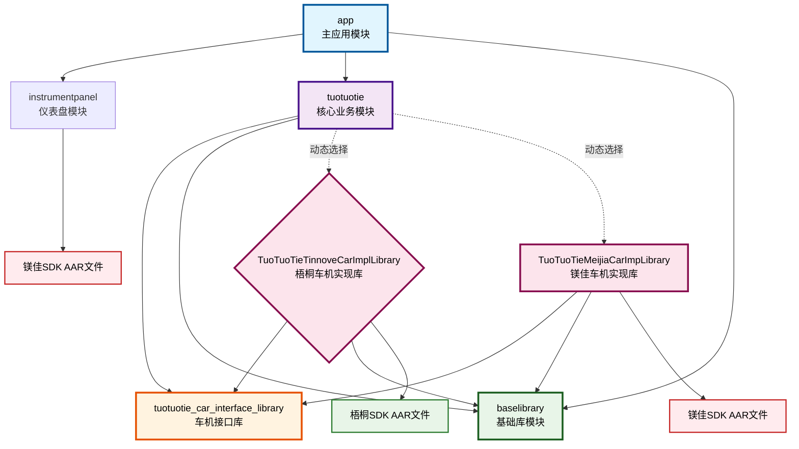
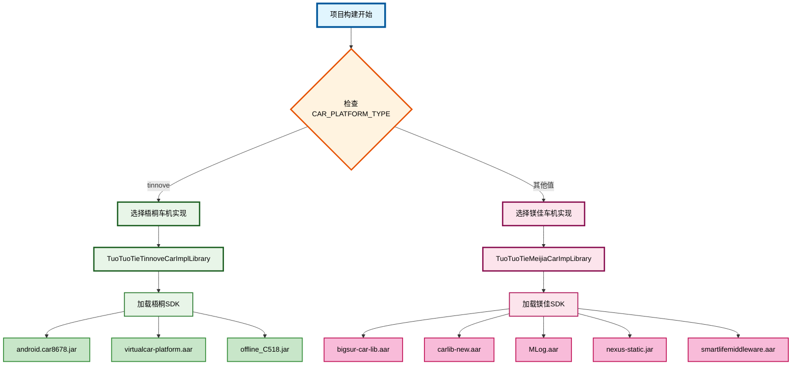

# SmartLife项目依赖关系图

## 项目模块依赖关系图

### 模块说明

- **app**: 主应用模块，包含应用入口和主要UI
- **instrumentpanel**: 仪表盘模块，负责仪表盘相关功能
- **tuotuotie**: 核心业务模块，包含主要业务逻辑
- **baselibrary**: 基础库模块，提供通用工具和基础功能
- **tuotuotie_car_interface_library**: 车机接口库，定义车机相关接口
- **TuoTuoTieTinnoveCarImplLibrary**: 梧桐车机实现库
- **TuoTuoTieMeijiaCarImpLibrary**: 镁佳车机实现库

## 车机平台动态选择流程图

### 流程说明

1. **项目构建开始**: 启动Gradle构建过程
2. **检查CAR_PLATFORM_TYPE**: 读取gradle.properties中的车机平台类型配置
3. **平台选择**:
   - 如果值为`tinnove`，选择梧桐车机实现
   - 其他值则选择镁佳车机实现
4. **加载对应实现库**: 根据选择加载相应的车机实现库
5. **加载SDK文件**: 加载对应平台的SDK文件

### 颜色说明

- **蓝色系**: 主应用和构建流程
- **绿色系**: 梧桐车机相关模块和SDK
- **粉色系**: 镁佳车机相关模块和SDK
- **橙色系**: 决策节点
- **紫色系**: 核心业务模块
- **青色系**: 基础库和工具

所有文字都设置为黑色以确保在彩色背景上的可读性。
