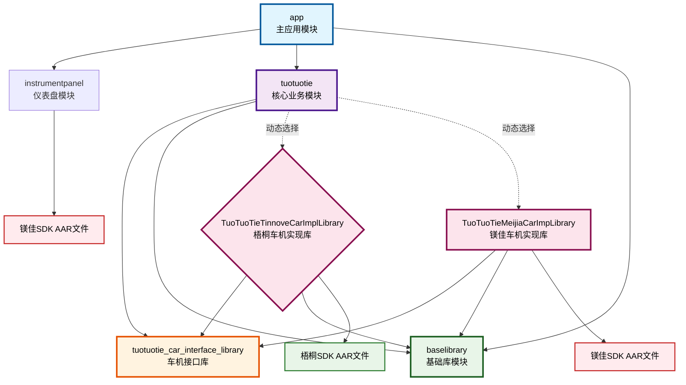
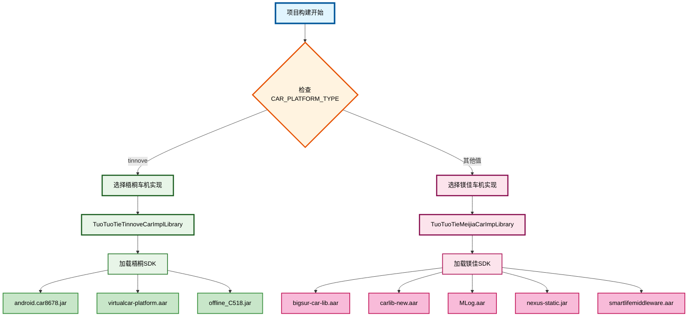

# SmartLife项目模块化方案详解

## 1. 整体模块化架构

这个项目采用了**分层模块化 + 平台适配**的架构设计，主要特点包括：

### 1.1 模块分层结构

```
┌─────────────────────────────────────────────────────────────┐
│                    🎯 应用层 (app)                          │
│                  主应用入口和UI容器                          │
└─────────────────────────────────────────────────────────────┘
                              │
┌─────────────────────────────────────────────────────────────┐
│                  🧠 业务逻辑层 (tuotuotie)                  │
│                核心业务逻辑和功能执行                        │
└─────────────────────────────────────────────────────────────┘
                              │
┌─────────────────────────────────────────────────────────────┐
│                🔌 接口抽象层 (tuotuotie_car_interface_library) │
│                   车机功能接口定义                          │
└─────────────────────────────────────────────────────────────┘
                              │
┌─────────────────────────────────────────────────────────────┐
│              🏗️ 平台实现层 (动态选择)                        │
│  ┌─────────────────────┐    ┌─────────────────────────────┐  │
│  │ 梧桐车机实现库       │    │ 镁佳车机实现库              │  │
│  │ TinnoveCarImpl     │    │ MeiJiaCarImpl              │  │
│  └─────────────────────┘    └─────────────────────────────┘  │
└─────────────────────────────────────────────────────────────┘
                              │
┌─────────────────────────────────────────────────────────────┐
│                🛠️ 基础工具层 (baselibrary)                  │
│                   通用工具和基础功能                        │
└─────────────────────────────────────────────────────────────┘
```

## 2. 核心模块化设计原则

### 2.1 单一职责原则
每个模块都有明确的职责边界：

- **app模块**: 只负责应用入口、UI展示和模块组装
- **tuotuotie模块**: 专注业务逻辑和功能执行
- **baselibrary模块**: 提供通用工具和基础功能
- **车机接口库**: 定义车机功能的标准接口
- **车机实现库**: 针对特定平台的具体实现

### 2.2 依赖倒置原则
通过接口抽象实现依赖倒置：

```kotlin
// 接口定义在 tuotuotie_car_interface_library
interface ICarFunctionExecutor {
    suspend fun setAirCdFront()
    suspend fun increaseACTemperature()
    // ... 其他车机功能
}

// 具体实现在各平台实现库中
class TinnoveCarFunctionExecutor : ICarFunctionExecutor {
    override suspend fun setAirCdFront() {
        // 梧桐平台具体实现
    }
}

class MeiJiaCarFunctionExecutor : ICarFunctionExecutor {
    override suspend fun setAirCdFront() {
        // 镁佳平台具体实现
    }
}
```

### 2.3 开闭原则
通过动态依赖选择实现开闭原则：

```kotlin
// 在 tuotuotie/build.gradle.kts 中
val carPlatformType = project.findProperty("CAR_PLATFORM_TYPE") as String? ?: "tinnove"

when (carPlatformType) {
    "tinnove" -> {
        implementation(project(":TuoTuoTieTinnoveCarImplLibrary"))
    }
    else -> {
        implementation(project(":TuoTuoTieMeijiaCarImpLibrary"))
    }
}
```

## 3. 依赖注入模块化设计

### 3.1 分层依赖注入模块

项目使用Hilt进行依赖注入，按功能分层组织：

```kotlin
// AppModule.kt - 应用级依赖
@Module
@InstallIn(SingletonComponent::class)
object AppModule {
    @Provides
    @Singleton
    fun provideDatabase(@ApplicationContext context: Context): AppDatabase
    
    @Provides
    @Singleton
    fun provideDeviceDao(database: AppDatabase): DeviceDao
}

// FunctionExecutorModule.kt - 功能执行器依赖
@Module
@InstallIn(SingletonComponent::class)
abstract class FunctionExecutorModule {
    @Binds
    @Singleton
    abstract fun bindFunctionExecutor(impl: FunctionExecutorImpl): FunctionExecutor
}
```

### 3.2 接口绑定模块化

通过BindsModule实现接口与实现的解耦：

```kotlin
@Module
@InstallIn(SingletonComponent::class)
abstract class BindsModule {
    @Binds
    @Singleton
    abstract fun bindBleManager(bleManagerImpl: BleManagerImpl): BleManager
    
    @Binds
    @Singleton
    abstract fun bindDeviceRepository(deviceRepositoryImpl: DeviceRepositoryImpl): DeviceRepository
}
```

## 4. 平台适配模块化方案

### 4.1 接口抽象层设计

```kotlin
// tuotuotie_car_interface_library 定义标准接口
interface ICarFunctionExecutor {
    // 车机功能接口定义
}

interface IDisplayMKStatus {
    fun displayMKStatus(): Int
}

interface IFunctionConfigCheck {
    // 功能配置检查接口
}
```

### 4.2 平台实现层设计

每个平台实现库都实现相同的接口，但内部实现不同：

```kotlin
// TinnoveCarImplLibrary
class TinnoveCarFunctionExecutor : ICarFunctionExecutor {
    // 使用梧桐平台SDK实现
    private val tinnoveSDK = TinnoveSDK()
}

// MeiJiaCarImplLibrary  
class MeiJiaCarFunctionExecutor : ICarFunctionExecutor {
    // 使用镁佳平台SDK实现
    private val meiJiaSDK = MeiJiaSDK()
}
```

### 4.3 动态平台选择机制

通过Gradle构建时动态选择平台实现：

```kotlin
// 在应用启动时通过EntryPoint获取平台特定实现
@EntryPoint
@InstallIn(SingletonComponent::class)
interface CarFunctionExecutorEntryPoint {
    ICarFunctionExecutor getCarFunctionExecutor()
}
```

## 5. 业务逻辑模块化设计

### 5.1 功能执行器模式

采用策略模式实现功能执行器的模块化：

```kotlin
interface FunctionExecutor {
    suspend fun executeFunction(function: ButtonFunction, buttonType: ButtonType, macAddress: String)
}

@Singleton
class FunctionExecutorImpl @Inject constructor(
    private val appExecutor: AppFunctionExecutor,
    private val mediaExecutor: MediaFunctionExecutor,
    private val carFunctionExecutor: ICarFunctionExecutor
) : FunctionExecutor {
    
    override suspend fun executeFunction(function: ButtonFunction, buttonType: ButtonType, macAddress: String) {
        when (function.category) {
            FunctionCategory.APP -> appExecutor.execute(function, buttonType)
            FunctionCategory.MEDIA -> mediaExecutor.execute(function, buttonType)
            FunctionCategory.CAR -> carFunctionExecutor.execute(function, buttonType)
        }
    }
}
```

### 5.2 Repository模式

数据访问层的模块化设计：

```kotlin
interface DeviceRepository {
    suspend fun getDevices(): Flow<List<Device>>
    suspend fun saveDevice(device: Device)
    suspend fun updateDevice(device: Device)
}

@Singleton
class DeviceRepositoryImpl @Inject constructor(
    private val deviceDao: DeviceDao,
    private val bleManager: BleManager
) : DeviceRepository {
    // 具体实现
}
```

## 6. 模块化优势

### 6.1 可维护性
- **职责清晰**: 每个模块职责单一，易于理解和维护
- **低耦合**: 模块间通过接口通信，降低耦合度
- **高内聚**: 相关功能集中在同一模块内

### 6.2 可扩展性
- **平台扩展**: 新增车机平台只需实现接口即可
- **功能扩展**: 新增功能类型只需添加新的执行器
- **模块扩展**: 可以独立开发和测试各个模块

### 6.3 可测试性
- **单元测试**: 每个模块可以独立进行单元测试
- **集成测试**: 通过Mock接口实现集成测试
- **平台测试**: 可以针对不同平台进行专门测试

### 6.4 团队协作
- **并行开发**: 不同团队可以并行开发不同模块
- **接口契约**: 通过接口定义明确的模块间契约
- **版本管理**: 各模块可以独立进行版本管理

## 7. 模块化最佳实践

### 7.1 接口设计原则
- **接口隔离**: 接口职责单一，避免臃肿接口
- **依赖抽象**: 依赖接口而非具体实现
- **版本兼容**: 接口变更要考虑向后兼容性

### 7.2 依赖管理原则
- **最小依赖**: 只依赖必要的模块
- **避免循环依赖**: 通过接口抽象避免循环依赖
- **依赖方向**: 依赖方向应该从高层模块指向低层模块

### 7.3 配置管理原则
- **环境隔离**: 不同环境使用不同配置
- **动态配置**: 通过构建时配置实现平台选择
- **配置集中**: 统一管理配置信息

## 8. 模块依赖关系图



## 9. 车机平台动态选择流程



## 10. 总结

这种模块化方案使得项目具有良好的可维护性、可扩展性和可测试性，特别适合多平台车机应用这种需要适配不同硬件平台的复杂项目。

### 核心特点：
1. **分层架构**: 清晰的分层结构，职责明确
2. **接口抽象**: 通过接口实现平台无关的业务逻辑
3. **动态选择**: 构建时动态选择平台实现
4. **依赖注入**: 使用Hilt实现松耦合的依赖管理
5. **策略模式**: 功能执行器采用策略模式实现可扩展性

### 适用场景：
- 多平台适配的复杂应用
- 需要支持不同硬件平台的系统
- 团队协作开发的大型项目
- 需要高可测试性和可维护性的应用
